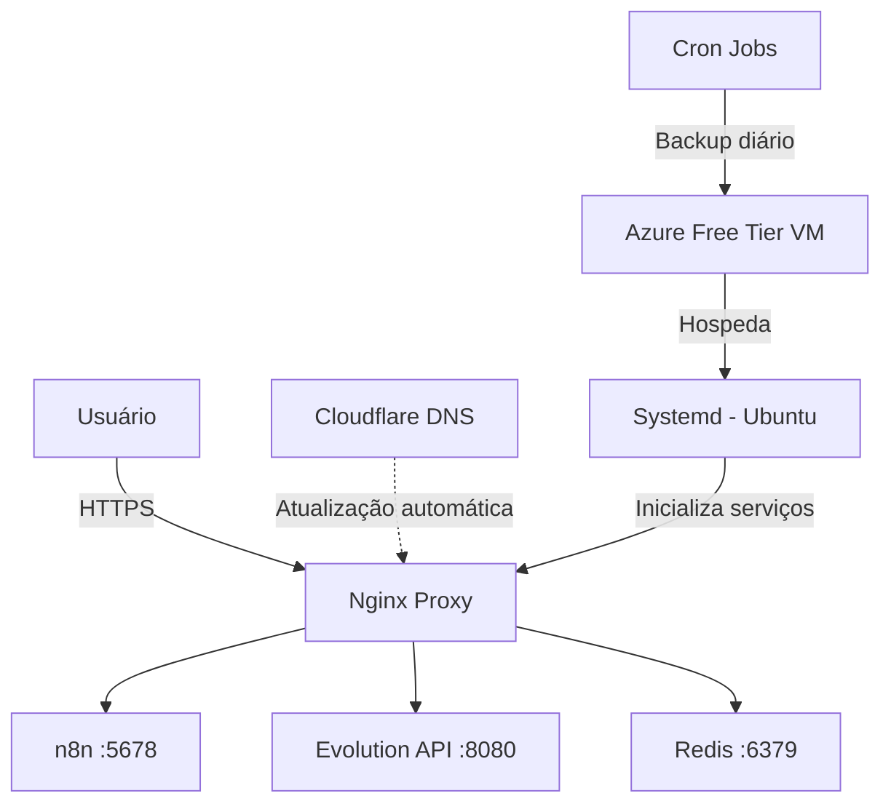

# 🚀 Infraestrutura de Automação na Azure

[](https://opensource.org/licenses/MIT)
[](https://azure.microsoft.com/)
[](https://www.docker.com/)
[](https://n8n.io/)

> Plataforma de automação na Azure com **custo zero**, utilizando Docker Compose, Nginx, Redis, n8n e Evolution API. Inclui automação de inicialização, atualização dinâmica de DNS via Cloudflare e backups diários.

---

## 📘 Visão Geral

Este projeto implementa uma infraestrutura de automação **100% automatizada e gratuita** na Azure, aproveitando o Free Tier para criar um ambiente completo de automação e integração.

### 🎯 Principais Recursos

- **n8n** - Automação de fluxos de trabalho (workflows)
- **Evolution API** - Integrações com WhatsApp e outras plataformas
- **Redis** - Cache em memória e gerenciamento de filas
- **Nginx** - Proxy reverso com SSL/TLS
- **DNS Dinâmico** - Atualização automática via Cloudflare API
- **Backup Automatizado** - Snapshots diários da VM

---

## 🏗️ Arquitetura da Solução



---

## ⚙️ Automação Implementada

| Automação | Descrição | Ferramenta |
|-----------|-----------|------------|
| **Inicialização/Desligamento** | Agendamento automático da VM | Azure Automation |
| **DNS Dinâmico** | Detecção e atualização do IP público | Cloudflare API + Script Bash |
| **Boot Automático** | Inicialização de serviços no boot | Systemd |
| **Backup** | Snapshots diários da VM | Azure Backup |
| **Monitoramento** | Health checks dos containers | Docker Compose |

---

## 🧠 Stack Tecnológico

```yaml
Cloud Provider: Azure (Free Tier)
Containerização: Docker + Docker Compose
Web Server: Nginx (Proxy Reverso + SSL)
Cache/Queue: Redis 7.x
Automação: n8n (Self-hosted)
Integração: Evolution API
DNS: Cloudflare
Sistema Operacional: Ubuntu 22.04 LTS
Scripts: Bash + Systemd
```

---

## 🚀 Instalação

### Pré-requisitos

- VM Ubuntu 22.04 na Azure (Free Tier)
- Docker e Docker Compose instalados
- Domínio configurado no Cloudflare
- Chaves de API da Cloudflare

### Passo a Passo

1. **Clone o repositório**

```bash
git clone https://github.com/eduardosato/azure-automation-infra.git
cd azure-automation-infra
```

2. **Configure as variáveis de ambiente**

```bash
cp .env.example .env
nano .env
```

Edite as seguintes variáveis:

```env
# Cloudflare
CLOUDFLARE_EMAIL=seu-email@dominio.com
CLOUDFLARE_API_KEY=sua_chave_api_aqui
CLOUDFLARE_ZONE_ID=seu_zone_id
CLOUDFLARE_RECORD_ID=seu_record_id
DOMAIN=seu-dominio.com

# n8n
N8N_BASIC_AUTH_USER=admin
N8N_BASIC_AUTH_PASSWORD=sua_senha_segura

# Evolution API
EVOLUTION_API_KEY=sua_chave_api_evolution

# Redis
REDIS_PASSWORD=sua_senha_redis
```

3. **Inicie os containers**

```bash
docker-compose up -d
```

4. **Configure o script de atualização de DNS**

```bash
sudo cp scripts/update-dns.sh /usr/local/bin/
sudo chmod +x /usr/local/bin/update-dns.sh
```

5. **Configure o systemd**

```bash
sudo cp systemd/dns-updater.service /etc/systemd/system/
sudo systemctl enable dns-updater.service
sudo systemctl start dns-updater.service
```

6. **Acesse as aplicações**

- n8n: `https://seu-dominio.com/n8n`
- Evolution API: `https://seu-dominio.com/evolution`

---

## 🔄 Script de Atualização de DNS

O script detecta automaticamente mudanças no IP público e atualiza o registro DNS no Cloudflare:

```bash
#!/bin/bash
# Script: update-dns.sh
# Descrição: Atualiza automaticamente o IP público no DNS da Cloudflare

set -e

# Carregar variáveis de ambiente
source /opt/automation/.env

# Obter IP público atual
CURRENT_IP=$(curl -s https://api.ipify.org)
echo "IP atual detectado: $CURRENT_IP"

# Obter IP registrado no Cloudflare
REGISTERED_IP=$(curl -s -X GET "https://api.cloudflare.com/client/v4/zones/$CLOUDFLARE_ZONE_ID/dns_records/$CLOUDFLARE_RECORD_ID" \
  -H "X-Auth-Email: $CLOUDFLARE_EMAIL" \
  -H "X-Auth-Key: $CLOUDFLARE_API_KEY" \
  -H "Content-Type: application/json" | jq -r '.result.content')

echo "IP registrado no DNS: $REGISTERED_IP"

# Atualizar se houver diferença
if [ "$CURRENT_IP" != "$REGISTERED_IP" ]; then
  echo "IPs diferentes! Atualizando DNS..."
  
  RESPONSE=$(curl -s -X PUT "https://api.cloudflare.com/client/v4/zones/$CLOUDFLARE_ZONE_ID/dns_records/$CLOUDFLARE_RECORD_ID" \
    -H "X-Auth-Email: $CLOUDFLARE_EMAIL" \
    -H "X-Auth-Key: $CLOUDFLARE_API_KEY" \
    -H "Content-Type: application/json" \
    --data "{\"type\":\"A\",\"name\":\"$DOMAIN\",\"content\":\"$CURRENT_IP\",\"ttl\":120,\"proxied\":false}")
  
  if echo "$RESPONSE" | jq -e '.success' > /dev/null; then
    echo "✅ DNS atualizado com sucesso!"
  else
    echo "❌ Erro ao atualizar DNS"
    exit 1
  fi
else
  echo "✅ IP já está atualizado. Nenhuma ação necessária."
fi
```

---

## 📁 Estrutura do Projeto

```
.
├── docker-compose.yml          # Orquestração dos containers
├── .env.example                # Exemplo de variáveis de ambiente
├── nginx/
│   ├── nginx.conf              # Configuração do Nginx
│   └── ssl/                    # Certificados SSL
├── scripts/
│   ├── update-dns.sh           # Script de atualização DNS
│   └── backup.sh               # Script de backup
├── systemd/
│   ├── dns-updater.service     # Service do systemd
│   └── docker-compose.service  # Service do Docker Compose
└── README.md
```

---

## 🔒 Segurança e Boas Práticas

### Implementado

- ✅ SSL/TLS via Let's Encrypt ou certificados próprios
- ✅ Containers isolados em rede Docker
- ✅ Variáveis sensíveis em arquivo `.env` (não versionado)
- ✅ Backups automáticos diários
- ✅ Auto-recuperação em caso de reboot da VM
- ✅ Autenticação básica no n8n
- ✅ API keys para Evolution API

### Recomendações Adicionais

- Configure firewall (UFW) limitando portas expostas
- Use fail2ban para proteção contra força bruta
- Implemente rate limiting no Nginx
- Monitore logs regularmente

---

## 📊 Monitoramento

Para verificar o status dos serviços:

```bash
# Status dos containers
docker-compose ps

# Logs em tempo real
docker-compose logs -f

# Status do systemd
systemctl status dns-updater.service
systemctl status docker-compose.service
```

---

## 🔧 Troubleshooting

### Containers não iniciam

```bash
docker-compose down
docker-compose up -d --force-recreate
```

### DNS não atualiza

```bash
# Verificar logs do script
journalctl -u dns-updater.service -f

# Executar manualmente
/usr/local/bin/update-dns.sh
```

### SSL não funciona

```bash
# Verificar certificados
ls -la nginx/ssl/

# Recarregar Nginx
docker-compose restart nginx
```

---

## 🎯 Roadmap

- [ ] Implementar CI/CD com GitHub Actions
- [ ] Adicionar Prometheus + Grafana para monitoramento
- [ ] Configurar alertas via Telegram/Discord
- [ ] Implementar logs centralizados (ELK Stack)
- [ ] Adicionar Traefik como alternativa ao Nginx

---

## 📄 Licença

Este projeto está sob a licença MIT. Veja o arquivo [LICENSE](LICENSE) para mais detalhes.

---

## 👤 Autor

**Eduardo Sato**  
Desenvolvedor Full Stack | DevOps Enthusiast

[](https://linkedin.com/in/edsato)
[](https://github.com/eduardosato22)

---

## 🤝 Contribuindo

Contribuições são bem-vindas! Sinta-se à vontade para:

1. Fazer um fork do projeto
2. Criar uma branch para sua feature (`git checkout -b feature/AmazingFeature`)
3. Commit suas mudanças (`git commit -m 'Add some AmazingFeature'`)
4. Push para a branch (`git push origin feature/AmazingFeature`)
5. Abrir um Pull Request

---

## ⭐ Mostre seu apoio

Se este projeto foi útil para você, considere dar uma ⭐️!

---

<div align="center">
  <sub>Construído com ❤️ por Eduardo Sato</sub>
</div>
